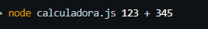
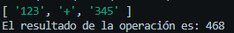

# Instalación y uso de la calculadora

## Instalación

1. Copia la carpeta de instalación en el entorno donde vas a utilizar la aplicación de la calculadora.

2. Abre una terminal desde la carpeta donde se encuentra la aplicación.

## Uso de la aplicación

Escribe en la línea de comandos de la terminal el siguiente comando: node calculadora.js numero1 operador numero2

### Descripción de los parámetros
-numero1:  equivale al primer número que se va a utilizar para la operación que se va a realizar en la calculadora

-operador: equivale al operador que representa la operación que se quiere realizar en la calculadora.  Tener en cuenta que la calculadora recibe las siguientes operaciones **`+`**, **`-`**, **`*`**, **`/`**

### Ejemplo

Si deseas realizar la resta de dos números debes ingresar en la línea de comandos lo siguiente:  **`node calculadora.js 123 + 345`**  



y ejecutaral ejecutar el resultado es el siguiente:



## Observaciones

1. Los parámetros `numero1 y numero2` deben ser números, en caso contrario la aplicación generará el mensaje:

```js
"Los valores ingresados no son números"
```

2. El parámetro `operacion` debe ser **`+`**, **`-`**, **`*`** o **`/`**, en caso de ingresarse otro valor la aplicación generará el siguiente mensaje:

```js
"Ingresa una operación válida"
```

3. Para el caso de la operación con división **`/`**, el valor del parámetro `numero2` no debe ser `0` ya que esta operación no se puede realizar, en caso de que se ingrese este valor en el parámetro, la aplicación generará el siguiente mensaje:

```js
"No se puede dividir por 0"
```


