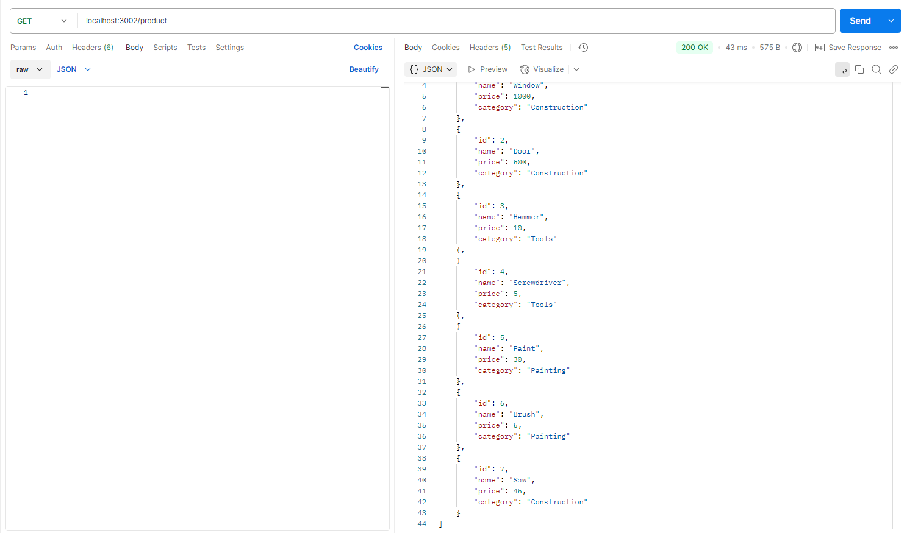
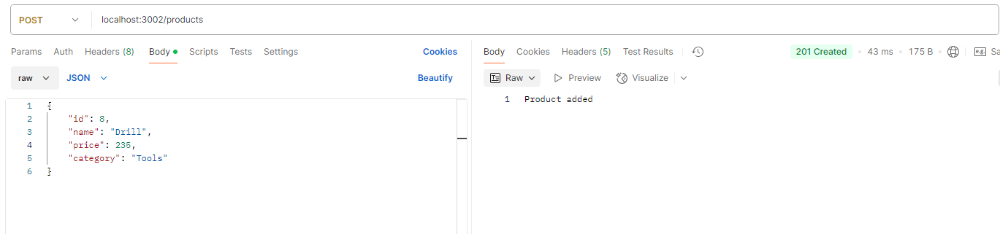
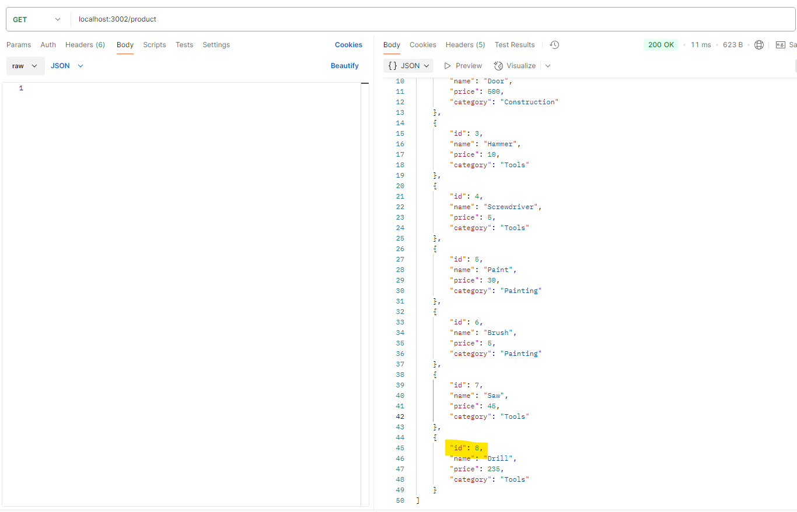
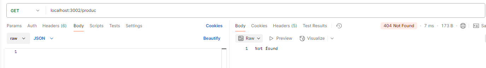

# API Products

## Uso

1. La url para consumir la API es 'localhost:3002'

2. La API tiene dos endpoint `GET /product` y  `POST /products`

## Uso de la aplicación

-Si deseas consultar los productos debes acceder al endpoint `GET /product`:

-Si deseas agregar un producto al catálogo debes acceder al endpoint `POST /products`  y enviar en la pestaña Body la información con la siguiente estructura:

{
    "id": número identificador del producto,
    "name": "Sawnombre del producto",
    "price": Valor del Producto,
    "category": "Categoría del Producto"
}

Se consulta el Get nuevamente y aparece el nuevo producto:

## Observaciones

1. Si se intenta consumir un endpoint inexistente el APi responderá not Found:

