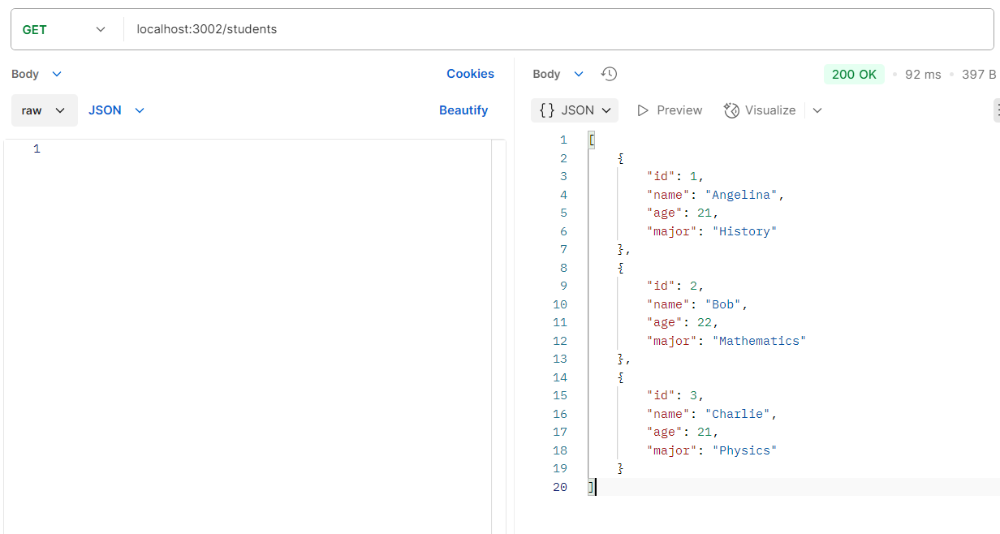
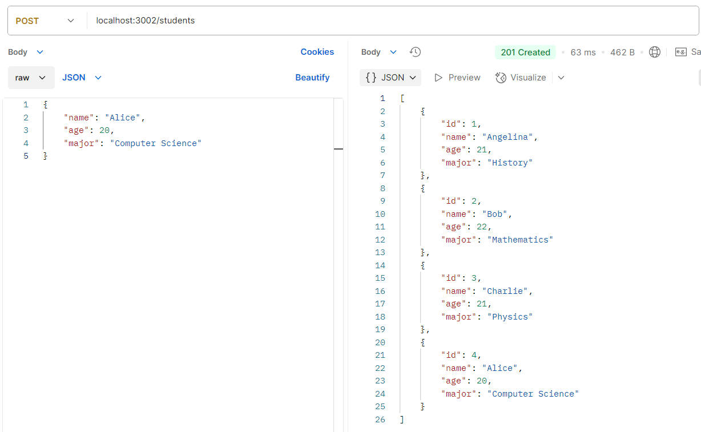
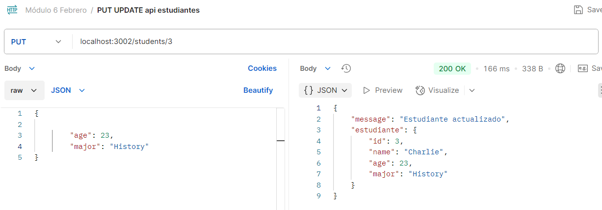
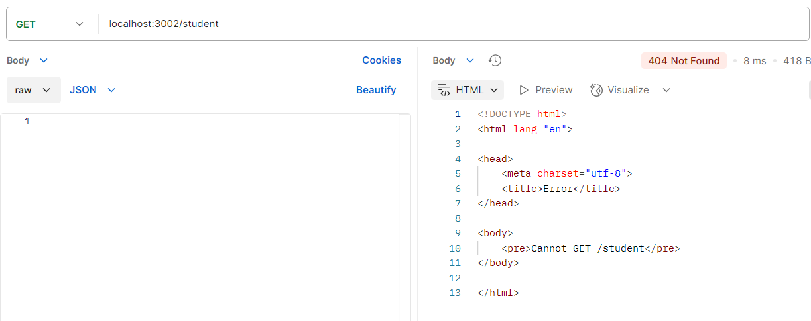

# API Gestión de estudiantes

## Descripción

1. La url para consumir la API es 'localhost:3002'

2. La API tiene cinco endpoint `GET /students`, `GET /studentS/:id`, `POST /students`, `PUT /students`, y  `DELETE /students`.

## Uso de la aplicación

#### GET
-Para consultar todos los estudiantes se debe acceder al endpoint `GET /students`:

Esta consulta cuenta con una validación de archivo vacío, en caso de que el listado no tenga información:

-Para consultar un estudiante en particular se debe acceder al endpoint `GET /students/:id`, donde id es el identificador del estudiante que se desea consultar:

Esta consulta tiene la validación para mostrar al usuario si el estudiante a consultar no existe:

#### POST
-Para crear un estudiante nuevo se debe acceder al endpoint `POST /students` y enviar en la pestaña Body la información con la siguiente estructura:

{    
    "name": "Nombre del estudiante",
    "age": Edad del estudiante,
    "major": "Materia destacada"
}

Este endpoint contiene la validación para la integridad de los datos:
- Valida que los campos tengan información:

- Valida que la edad sea un dato numérico.

#### PUT
-Para actualizar la información de algún estudiante se debe acceder al endpoint `POST /students:id`, donde id es el identificador del estudiante que se desea actualizar, se debe enviar en la pestaña Body la información a actualizar:  `name`, `age`, `major`; teniendo en cuenta que puede enviar solo los atributos a actualizar:

Tener en cuenta que este endpoint cuenta con las mismas validaciones de integridad de datos que el POST.

#### DELETE
-Para eliminar algún estudiante se debe acceder al endpoint `DELETE /students:id`, donde el id corresponde al identificador del estudiante que se desea eliminar:

## Observaciones

1. Si se intenta consumir un endpoint inexistente el APi responderá not Found:

